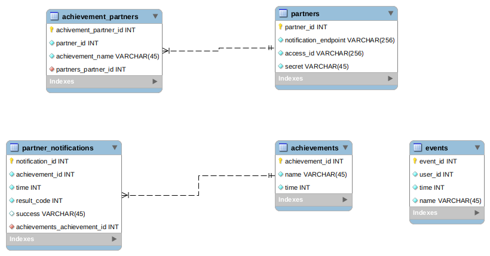

# Ovia incentive system

The Ovia incentive system is a proposal for a new feature that strives to achieve more complete employer integration.

## Goals of the integration
* Strengthen the palette of mechanisms partners and employers can use to target their engagement incentives and help them set up meaningful interactions with their employees through Ovia.
* Provide a platform for Ovia users with rich and relevant information, products, and services to make them feel secure they are not missing anything in terms of preparation or assistance during the pregnancy, birth, and early childhood.
* Build trust with employers and partners that they are informed when achievement criteria are met, every single time.

## Assumptions about the current system
* The system runs on AWS and is configured with high availability such that every part of the system has redundancy so that any failure of one of the services will not result in the entire system going down.
* The front end of the system is a mobile application, making it convenient for the customer to keep their data current in the Ovia system at any time and any place.
* Performance of the system is a primary consideration, so there is no impediment for the user to enter data at any time.
* Employers and partners that are interested in being notified of particular achievements will have an application set up that the Incentive application will talk to. This system will use some sort of account ID and secret, which the Incentive application will need in order to perform the noticifacion.

# Design considerations
The data that drives this system is largely provided through mobile applications sent via REST API calls to the Ovia application. In order to keep the system responsive, it is important that the additional processing required to figure out whether a particular event triggers an achievement and the notification of partners and employers is performed outside of the web request.

There are several ways this could be accomplished, but in this architecture I will pursue a separation of event processing from the existing backend system. This will allow the event processing system to be implemented by a separate team than the one responsible for the Ovia backend which may improve time to market. It would also allow the introduction of new technologies that may be more difficult or expensive to apply to the existing Ovia backend. Further, the event system can scale independently of the existing Ovia backend.

# Architecture

# Schema
*Note:* While I understand the project is about employers engaging more completey with their employees, such incentive events would also likely be quite interesting for partners. The particulars of the design of this solution will take that into account, so in the database where "partner" is used, this could be for either a partner or for an employer.

# Incentive events menu

* Consistent logger - The user has logged data for at least 5 consecutive days.
* Birth reported - The user has reported the birth of their child.
* Pregnancy reported - The user has reported they have become pregnant.

# Event types
Note that some events have a one-to-one relationship with achievements, such as reporting a birth. Other events have a many-to-one relationship with achievements, such as the consistent logger.

In each case, one or more events will be mapped to an achievement, or eventually discarded. For example, if the user records health data for four consecutive days but skips the fifth day, the previous four days of logging data do not count toward that particular achievement and the data around these events could be discarded.

For the purposes of this architecture and the related code I will refer to the events that have a one-to-one relationship with an achievement as "Immediate" events. In this case the achievement must be recorded so the achievement is not awarded multiple times and the customer must be notified of the achievement. No records of the underlying event need to be remembered.

Achievements that require a particular sequence of events to unlock will be referred to as "Progressive" events. These events will require some storage until the sequence of events either successfully results in an achievement or fails to do so. This event memory can be purged regularly of events that fall outside of a timeline deemed interesting for the purposes of partner integrations. When an event comes in that may be part of the desired pattern, a quick evaluation can be made to determine if the achievement has been unlocked.

# Missing from the implementation
* I didn't implement any storage, though I did assume there would be a SQL database behind the application.
* The event receiever - this is the part of the system that receives a single event from SQS and uses the EventFactory to instantiate an Event instance of the appropriate class:
<pre>
$result = $aws_client->receiveMessage($connection_details);
 if ($result->get('Messages')) {
     foreach ($result->get('Messages') as $message) {
         try {
             $event = EventFactory::fromJSON($message['Body']);
             $event_processor->processEvent($event);
         } catch (\Exception $e) {
             // Send an error to SignalFX and log the issue.
         }
         $client->deleteMessage(['QueueUrl' => $connection_details->QueueUrl, 'ReceiptHandle' => $message['ReceiptHandle']]);
    }
 }
</pre

* The association between an event and the AchievementEvaluator instance that will indicate whether the event should cause the achievement to be awarded is also not in the implementation. I was a bit torn on this one - will it always be the case that a HealthLogEvent only drives toward a HealthAchievement? Probably not in the long term. The solution here could simply be to try all of the AchievementEvaluators to see if the specified Event should cause an achievement to be awarded. This could get expensive in some cases however. That would prompt me to spend more time in this area of the design, to keep database load manageable. Or possibly reconsider what type of database to use. Here I have worked with SQL, but I am now thinking that a NoSQL database would have certain advantages.
* Notification of achievements awarded is touched on in the schema but there is no implementation for that here. That should be relatively straightforward given that we know what partners and employers are interested in which achievements and we know how to inform them of the achievemencts automatically through access to an application on their end (certainly better than email).

# Shortcomings
* I did not design a system in which these events and achievements could be designed by non-engineers. Each achievement has custom code that would evaluate whether the achievement should be awarded. A better system would be one in which a person in another role could interact with the Incentive application via a user interface and create achievements based on requirements from a partner or employer.
* I also did not write Unit tests, which I do for production code. This might have been a mistake since it doesn't represent my standard practice, but I took a chance that it would be more interesting to see the project get farther along rather than prove that each piece is working completely right.
* Without a storage layer, there were a few parts of the system that couldn't be implemented correctly. Particularly, the HealthLogAchievementEvaluator, which is responsible for figuring out whether an event should cause the HealthLogAchievement to be awarded. Hopefully my comments fill in the gap sufficiently.

