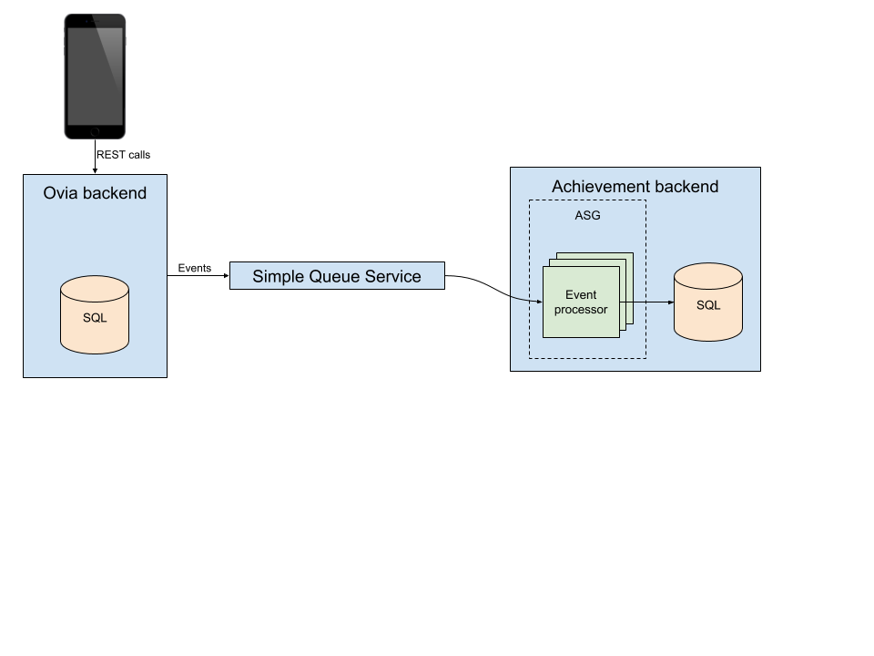

# Ovia incentive system

The Ovia incentive system is a proposal for a new feature that strives to achieve more complete partner integration, which will benefit Ovia, Ovia's partners, and Ovia's enterprise users.

## Goals of the integration
* Strengthen the palette of mechanisms partners can use to target their products and services and help them set up meaningful interactions with Ovia users
* Provide a platform for Ovia users with rich and relevant information, products, and services to make them feel secure they are not missing anything in terms of preparation or assistance during the pregnancy, birth, and early childhood
* Build trust with partners that they are informed when achievement criteria are met, every single time

## Assumptions about the current system
* The system runs on AWS and is configured with high availability such that every part of the system has redundancy so that any failure of one of the services will not result in the entire system going down.
* The front end of the system is a mobile application, making it convenient for the customer to keep their data current in the Ovia system at any time and any place.
* Performance of the system is a primary consideration, so there is no impediment for the user to enter data at any time.

# Design considerations
The data that drives this system is largely provided through mobile applications sent via REST API calls to the Ovia application. In order to keep the system responsive, it is important that the additional processing required to figure out whether a particular event triggers an achievement is performed outside of the web request.

There are several ways this could be accomplished, but in this architecture I will pursue a separation of event processing from the existing backend system. This will allow the event processing system to be implemented by a separate team than the one responsible for the Ovia backend which may improve time to market. It would also allow the introduction of new technologies that may be more difficult or expensive to apply to the existing Ovia backend. Further, the event system can scale independently of the existing Ovia backend.

# Architecture

# Incentive events menu

* Consistent logger - The user has logged data for at least 5 consecutive days.
* Birth reported - The user has reported the birth of their child.
* Pregnancy reported - The user has reported they have become pregnant.

# Event types
Note that some events have a one-to-one relationship with achievements, such as reporting a birth. Other events have a many-to-one relationship with achievements, such as the consistent logger.

In each case, one or more events will be mapped to an achievement, or eventually discarded. For example, if the user records health data for four consecutive days but skips the fifth day, the previous four days of logging data do not count toward that particular achievement and the data around these events could be discarded.

For the purposes of this architecture and the related code I will refer to the events that have a one-to-one relationship with an achievement as "Immediate" events. In this case the achievement must be recorded so the achievement is not awarded multiple times and the customer must be notified of the achievement. No records of the underlying event need to be remembered.

Achievements that require a particular sequence of events to unlock will require some amount of storage of the events. This event memory can be purged regularly of events that fall outside of a timeline deemed interesting for the purposes of partner integrations. When an event comes in that may be part of the desired pattern, a quick evaluation can be made to determine if the achievement has been unlocked.
